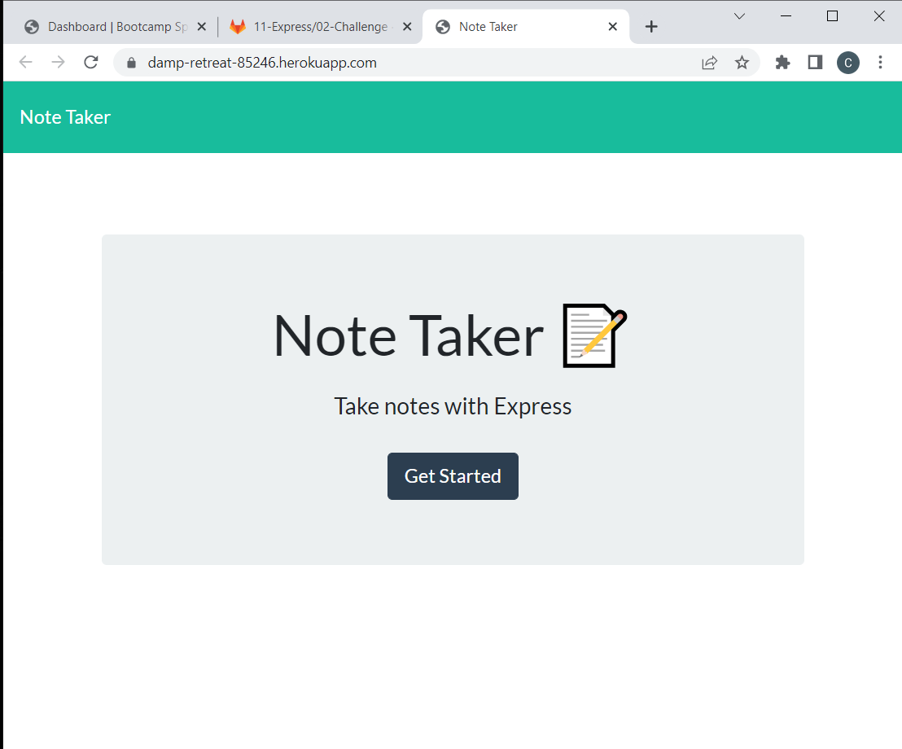
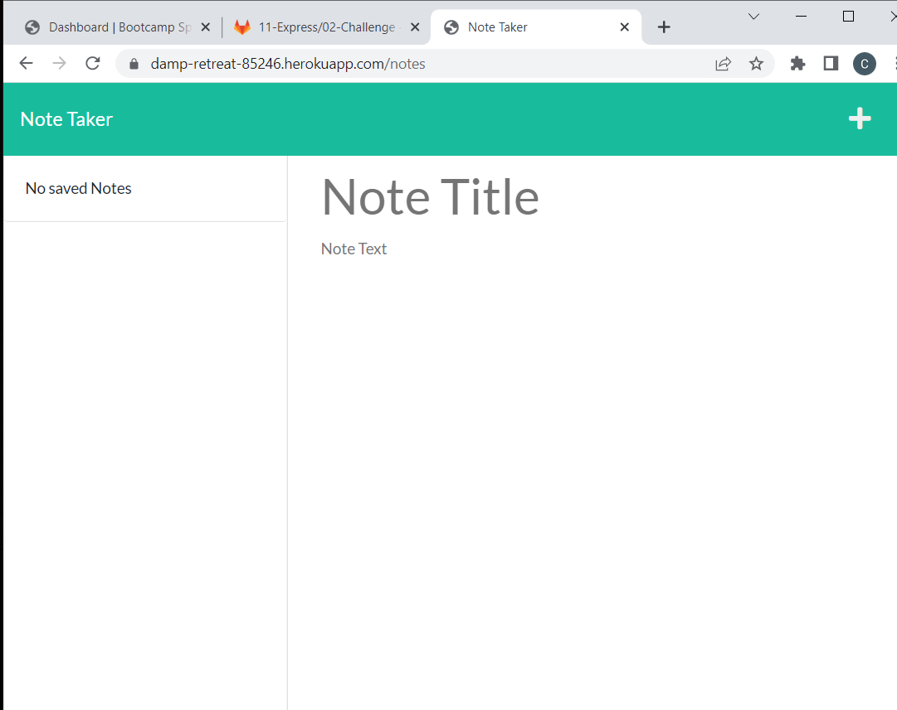
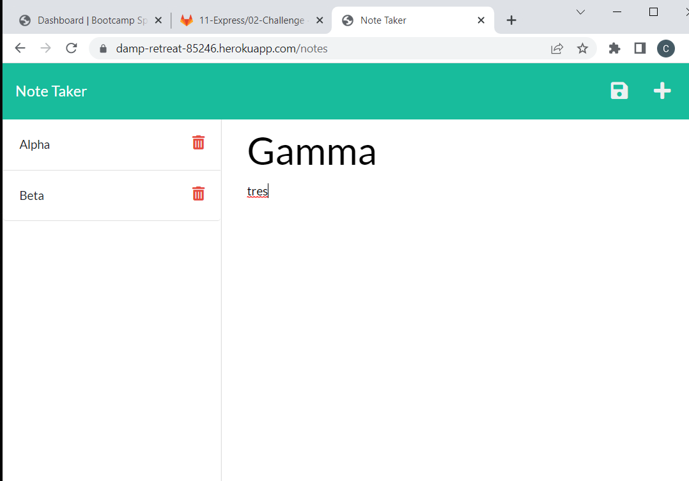
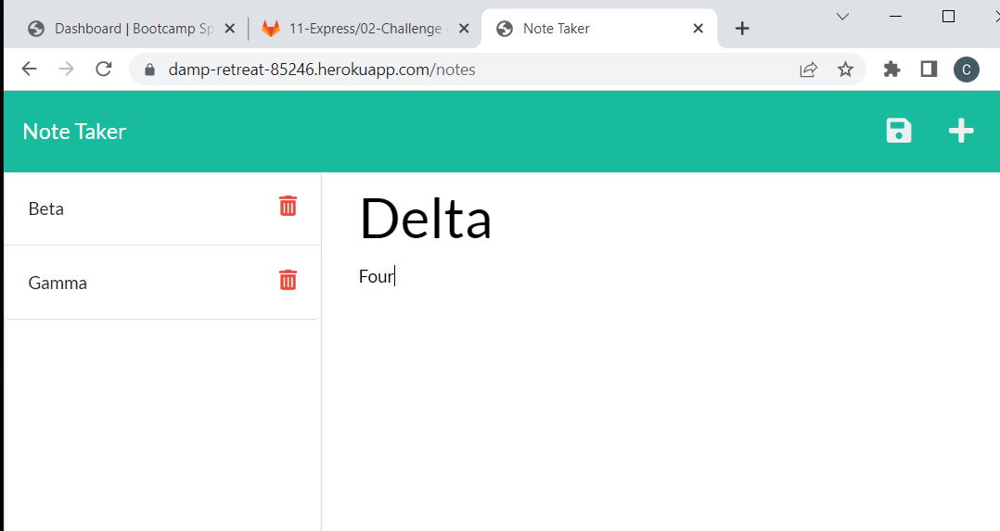

Note Taker

Issue:
Hello, and thank you for using Note Taker. Note Taker was created to assist in the issue with organizing and taking notes. This applicaton was created for the primary use to manage, maintain and delete notes.

Table of Contents:

- [Installation](#installation)
- [Features](#features)
- [Credits](#credits)
- [License](#license)
- [Images](#images)

## Installation:
For the installation of this program, you will be required to installnothing.
Clone the repository to your local machine, and make sure you are cd'd into the file from a programs GIT, if applicable. 

## Features:
Some of the main features in this app are:
*  Record notes and tasks
*  deleting completed notes and tasks

## Credits:
This application was created by Corey Levine, and can be found here:

* https://github.com/coreylevine2000/hw-11-Note-Taker (REPO)
* https://coreylevine2000.github.io/hw-11-Note-Taker/
* https://damp-retreat-85246.herokuapp.com/ (Proper Link for Deployment)

And a special Thank You to You!

## Licence:
This app was made with MIT License 

## Images:

